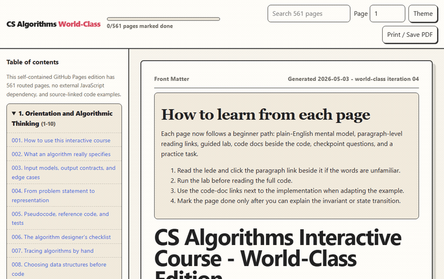

# CS Algorithms Interactive Course

[](https://github.com/adybag14-cyber/Course-Interactive/actions/workflows/pages.yml)

A self-contained, browser-based computer science algorithms course with 561 printable pages, an exported Jupyter notebook, search, progress tracking, quizzes, reference code sketches, page-specific labs, working diagrams, and interactive visualizers.

Open the live course here:

<https://adybag14-cyber.github.io/Course-Interactive/>

Direct HTML fallback:

<https://adybag14-cyber.github.io/Course-Interactive/cs_algorithms_interactive_course_500_pages.html>



## What This Includes

This repository contains a complete static course that can be opened directly in a browser or published through GitHub Pages without a build step.

- `cs_algorithms_interactive_course_500_pages.html` - the main self-contained 561-page course export.
- `cs_algorithms_interactive_course_500_pages.ipynb` - the companion notebook source/export.
- `index.html` - a small redirect page so the GitHub Pages root opens the course immediately.
- `.github/workflows/pages.yml` - the CI workflow that validates the static files and deploys them to GitHub Pages.
- `assets/interactive-preview.gif` - a short generated preview of the interactive sections.

## Course Features

- 561 pages of algorithms material organized into 37 chapters.
- Warm high-contrast reader theme tuned for long study sessions.
- Search across the full course from the top toolbar.
- Page number jump, table of contents navigation, and keyboard navigation.
- Local progress tracking with page completion checkboxes.
- Printable layout for turning the full course into a PDF.
- Copy buttons for reference implementation sketches.
- Checkpoint quizzes with revealable answers.
- Practice tasks for each topic.
- Browser-only interactive widgets that do not need a backend.
- A runnable page-specific lab, real code card, and rendered working diagram on every routed lesson page.

## Interactive Sections

The exported HTML includes several hands-on widgets:

- Page-specific labs - run the unique miniature example attached to each lesson.
- Page-specific working diagrams - trace sample input, invariant, transition, and output for each lesson.
- Complexity Explorer - compare growth functions and input sizes on a canvas.
- Binary Search Stepper - walk through a half-open interval search.
- Sorting Visualizer - animate bubble, insertion, and selection sort.
- Hash Table Simulator - insert keys and inspect chained collisions.
- Heap Playground - push values, pop the minimum, and see the heap shape.
- Union-Find Playground - union sets, run find, and toggle path compression.
- Graph Traversal Visualizer - step through BFS and DFS frontiers.
- Topological Sort Planner - run Kahn's algorithm on dependent tasks.
- Dijkstra Visualizer - settle shortest-path distances on a weighted graph.
- Dynamic Programming Table Builder - build Fibonacci states bottom-up.
- N-Queens Backtracking - render a valid board solution.
- KMP String Matching - build the prefix table and locate matches.
- Convex Hull Lab - generate random points and compute the hull.
- Final Study Planner - track completed chapters in local storage.

## Course Map

The course moves from foundations into advanced topics:

- Orientation, algorithmic thinking, input contracts, and invariants.
- Complexity analysis, recurrence reasoning, and proof techniques.
- Python and JavaScript tooling for algorithm experiments.
- Arrays, strings, searching, sorting, recursion, and divide and conquer.
- Stacks, queues, linked lists, hashing, trees, heaps, and disjoint sets.
- Graph traversal, DAG algorithms, shortest paths, MSTs, and flow.
- Dynamic programming, greedy methods, backtracking, string algorithms, and computational geometry.
- Randomized algorithms, approximation, streaming, external-memory ideas, systems algorithms, crypto, AI search, and final practice projects.
- Beginner bootcamp, visual algorithm atlas, interactive practice tracks, GitHub Pages publishing notes, accessibility checks, capstone rubrics, and a citation map.

## Run Locally

No installation is required for normal use.

1. Clone the repository:

   ```powershell
   git clone https://github.com/adybag14-cyber/Course-Interactive.git
   cd Course-Interactive
   ```

2. Open the course:

   ```powershell
   start .\index.html
   ```

The course is static. You can also open `cs_algorithms_interactive_course_500_pages.html` directly.

## GitHub Pages Deployment

Publishing is handled by GitHub Actions in `.github/workflows/pages.yml`.

The workflow runs on every push to `main` and on manual dispatch. It:

- checks out the repository;
- verifies that the course HTML, notebook, redirect page, and preview GIF exist;
- prepares a static `site` directory;
- uploads the Pages artifact;
- deploys it to the `github-pages` environment.

After the workflow succeeds, the course is available at:

<https://adybag14-cyber.github.io/Course-Interactive/>

If the link returns 404 immediately after a push, wait for the `Publish GitHub Pages` workflow to finish.

## Regenerating The Preview GIF

The checked-in preview GIF was generated locally from the static HTML with Playwright screenshots and ffmpeg palette conversion. A reproducible flow is:

1. Open the course in a browser automation tool.
2. Step through several widgets: complexity, sorting, graph traversal, Dijkstra, dynamic programming, and geometry.
3. Save numbered PNG frames.
4. Convert the frames to `assets/interactive-preview.gif` with ffmpeg.

Example ffmpeg conversion:

```powershell
ffmpeg -y -framerate 8 -i assets\preview-frames\frame%03d.png -vf "fps=8,scale=760:-1:flags=lanczos,split[s0][s1];[s0]palettegen=stats_mode=diff[p];[s1][p]paletteuse=dither=bayer:bayer_scale=3" assets\interactive-preview.gif
```

## Notes For Contributors

- Keep the course usable as a static site.
- Keep `index.html` as the root entrypoint for GitHub Pages.
- If the main HTML filename changes, update `index.html`, `README.md`, and `.github/workflows/pages.yml`.
- When adding new interactive widgets, keep them browser-only unless the deployment workflow is updated for a build step.
